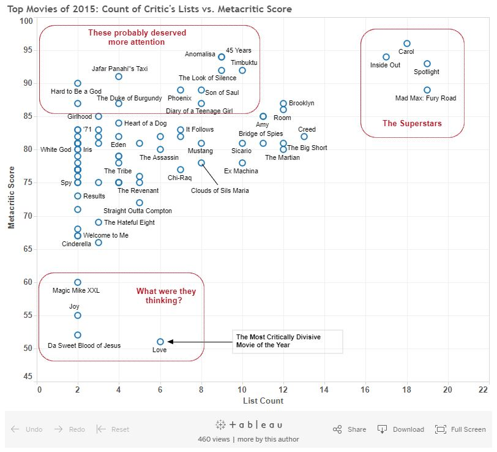
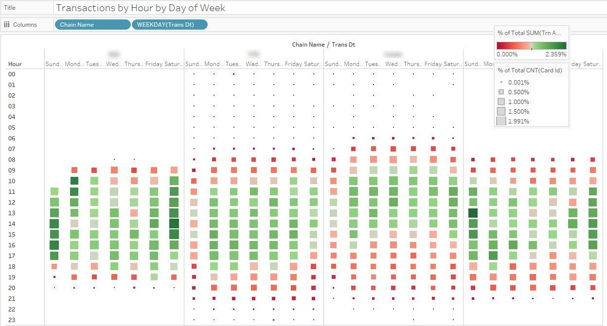
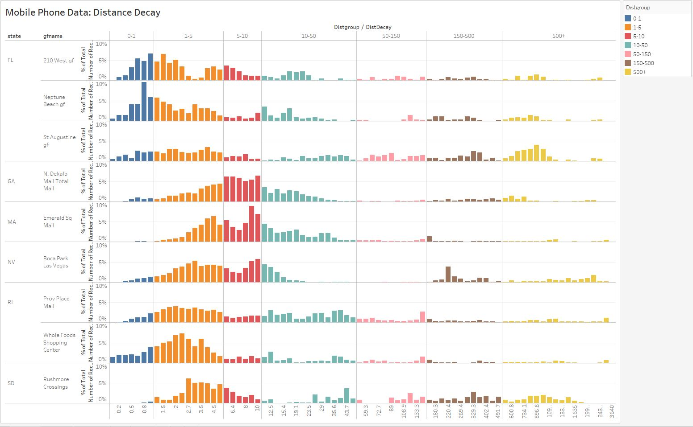
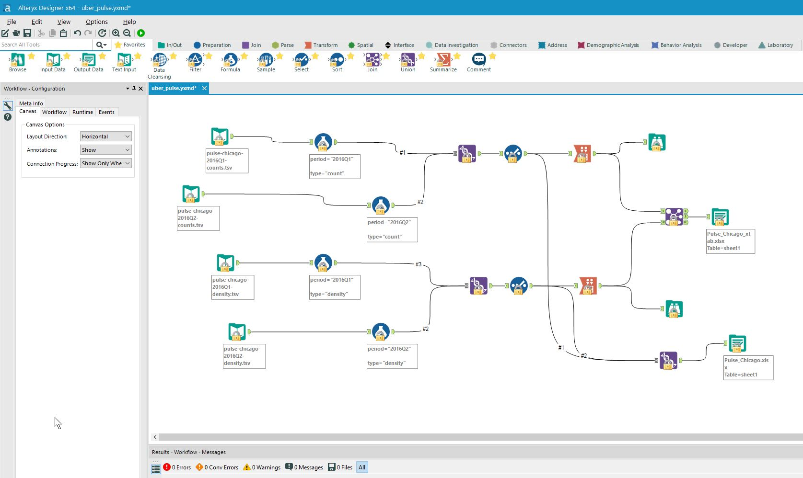

@title[Tableau - Tableau & Credit Card Data]
#### Tableau: Annual summary of Movies 
<p id="harttext">The year's top movies, a quantative approach.</p>

  

---

@title[Tableau - Tableau & Credit Card Data]
#### Tableau: Credit Card Data

<p id="harttext">Credit card transactions by time-of-week: four grocery chains.</p>

  
---


@title[Tableau - Tableau & Mobile Data]
#### Tableau: Mobile Phone Data
<span style="color: #242526; line-height: 80%; font-size: 60%">Using mobile device data to measure distance decay for a various shopping centers.</span>

  
---
@title[Tools]
#### Analytics Tools
Extensive Experience with tools such as Alteryx



---
@title[Cover]


### Hartwell Hooper
#### Professional Portfolio


<span style="color: #363b44; font-size: 80%">[BI, Strategy, GIS, Management Reporting & Analysis ]</span>
<br>

<span>
<style type="text/css">
.tg  {border-collapse:collapse;border-spacing:0;border-color:#aabcfe;}
.tg td{font-family:Arial, sans-serif;font-size:16px;padding:10px 5px;border-style:solid;border-width:0px;overflow:hidden;word-break:normal;border-color:#aabcfe;color:#669;background-color:#e8edff;}
.tg th{font-family:Arial, sans-serif;font-size:16px;font-weight:normal;padding:10px 5px;border-style:solid;border-width:0px;overflow:hidden;word-break:normal;border-color:#aabcfe;color:#039;background-color:#b9c9fe;}
.tg .tg-yw4l{vertical-align:top}
</style>
<table class="tg">
  <tr>
    <th class="tg-yw4l">Social Media:</th>
    <th class="tg-yw4l"></th>
  </tr>


  <tr>
    <td class="tg-yw4l">Blog</th>
    <td class="tg-yw4l">[VelvetBrain.net](http://velvetbrain.net)</th>
  </tr>
  <tr>
    <td class="tg-yw4l">Twitter</th>
    <td class="tg-yw4l">[@GeoDemogod](https://twitter.com/geodemogod)</th>
  </tr>
  <tr>
    <td class="tg-yw4l">LinkedIn</th>
    <td class="tg-yw4l">[Hartwell Hooper](https://www.linkedin.com/in/hartwell-hooper/)</th>
  </tr>

  <tr>
    <td class="tg-yw4l">Instagram</th>
    <td class="tg-yw4l">[@NotMyDogRI](https://www.instagram.com/notmydogri/?hl=en)</th>
  </tr>

  <tr>
    <td class="tg-yw4l">Facebook</th>
    <td class="tg-yw4l"> [Hartwell Hooper](https://www.facebook.com/hartwell.hooper)</th>
  </tr>


</table>
</span>

<span style="color: #669; font-size: 50%">use the arrow keys to advance</span>

---
@title[Social Media Links]

| Social Media |  | |
| -------------| ------------- |------------- |
| BI / Analytics | Blog  | [VelvetBrain.net](http://velvetbrain.net)  |
| BI / Analytics | Twitter  | [@GeoDemogod](https://twitter.com/geodemogod)  |
| Profesional | LinkedIn  | [Hartwell Hooper](https://www.linkedin.com/in/hartwell-hooper/) |
| Personal | Instagram  | [@NotMyDogRI](https://www.instagram.com/notmydogri/?hl=en) |
| Personal | Facebook  | [Hartwell Hooper](https://www.facebook.com/hartwell.hooper)  |


---
@title[Social Media Links]
Thanks your for visiting my personal portfolio site.  I want to say something more like a cover letter here, with perhaps a personal statement about why I chose this form.
---

@title[PITCHME.md]

#### GitPitch turns <span style="color: #e49436; text-transform: none">PITCHME.md</span> into
#### interactive,
#### online and offline slideshows.
<br>
<span style="color:gray; font-size:0.6em;">[ JUST LIKE THIS ONE ]</span>

---

#### No more <span style="color: gray">Keynote.</span>
#### No more <span style="color: gray">Powerpoint.</span>
<br>
#### Just <span style="color: #e49436">Markdown</span>.
#### Then <span style="color: #e49436">Git-Commit</span>.

---
@title[Step 1. Create 'PITCHME.md']

### <span style="color: #e49436">STEP 1. Create 'PITCHME.md'</span>
<br>

#### Create GitPitch slideshow content using GitHub Flavored Markdown in your favorite editor.

<br>
<span style="color:gray; font-size:0.6em;">[ AS EASY AS README.md ]</span>

---
@title[Step 2. Git-Commit]

### <span style="color: #e49436">STEP 2. GIT-COMMIT</span>
<br>

```shell
$ git add PITCHME.md
$ git commit -m "New slideshow content."
$ git push

Done!

```

@[1](Add your PITCHME.md slideshow content file.)
@[2](Commit PITCHME.md to your local repo.)
@[3](Push PITCHME.md to your public repo and you're done!)
@[5](Supports GitHub, GitLab, Bitbucket, GitBucket, Gitea, and Gogs.)

---
@title[Step 3. Done!]

### <span style="color: #e49436">STEP 3. GET THE WORD OUT!</span>

<br>

<span style="font-size: 1.3em;"><span style="color:white">htt</span><span style="color:white">ps://git</span><span style="color: #e49436">pitch</span><span style="color: white">.com/<span style="color: #e49436">user</span>/<span style="color: #e49436">repo</span>/<span style="color: #e49436">branch</span></span>

<br>

#### Instantly use your GitPitch slideshow URL to promote, pitch or present absolutely anything.

---
@title[Slide Rich]

### <span style="color: #e49436">Slide Rich</span>

#### Code Presenting for Blocks, Files, and GISTs
#### Image, Video, Chart, and Math Slides
#### Multiple Themes With Easy Customization
<br>
#### <span style="color: #e49436">Plus collaboration is built-in...</span>
#### Your Slideshow Is Part Of Your Project
#### Under Git Version Control Within Your Git Repo

---

@title[Feature Rich]

### <span style="color: #e49436">Feature Rich</span>

#### Present Online or Offline
#### With Speaker Notes Support
#### Print Presentation as PDF
#### Auto-Generated Table-of-Contents
#### Share Presentation on Twitter or LinkedIn

---

### Go for it.
### Just add <span style="color: #e49436; text-transform: none">PITCHME.md</span> ;)
<br>
<a style="font-size:0.6em;" href="https://github.com/gitpitch/gitpitch/wiki">[ Click To Learn More On Wiki ]</a>
